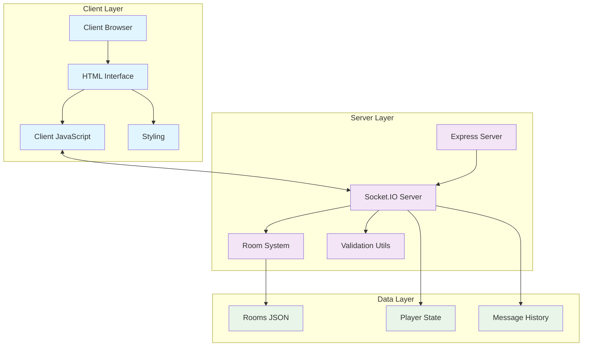
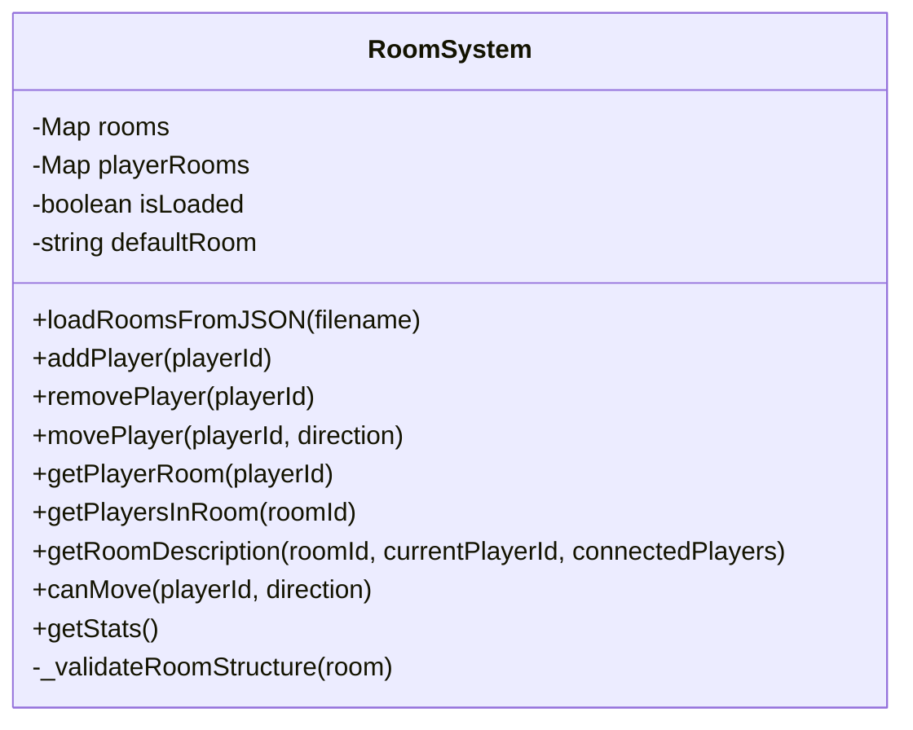
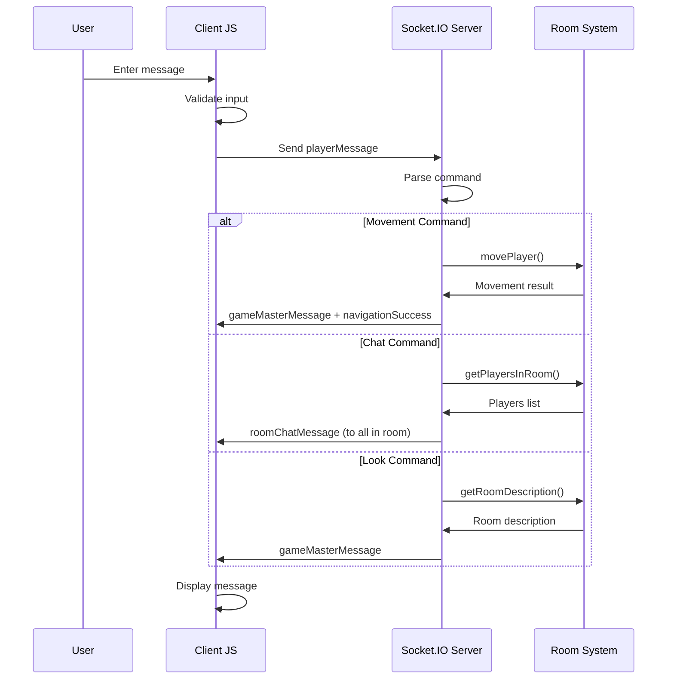
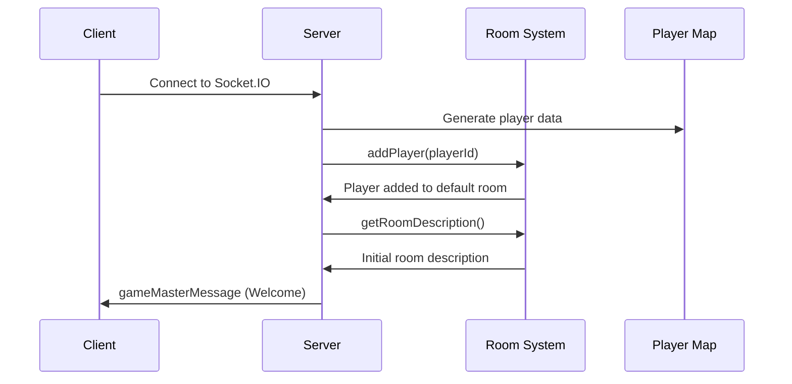
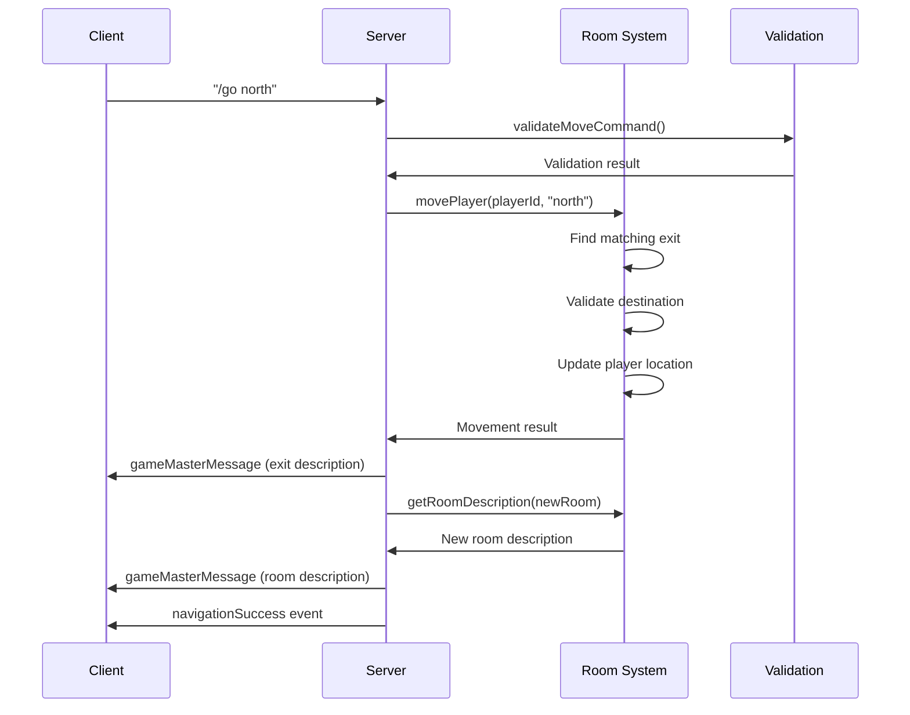
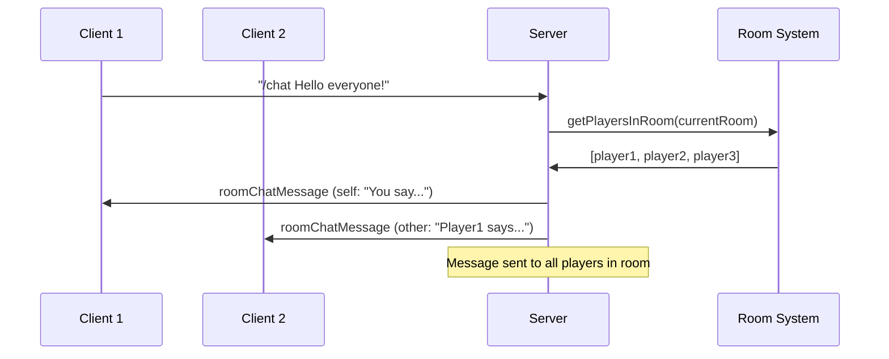

# JogoTesto - Architecture Documentation

## Overview

JogoTesto is a multiplayer text-based RPG experiment that leverages AI-driven development through Product Requirement Prompts (PRPs). The application provides real-time multiplayer functionality with a room-based navigation system, built using Node.js, Express, and Socket.IO.

## System Architecture



## Core Components

### 1. Server Layer (`src/server.js`)

The main application entry point that orchestrates all server-side functionality.

**Key Responsibilities:**
- Express server initialization and static file serving
- Socket.IO connection management
- Player state tracking and authentication
- Message routing and command processing
- Integration with room system and validation utilities

**Critical Functions:**
- `handleMoveCommand()` - Processes player movement requests
- `handleLookCommand()` - Handles room description requests
- `handleChatCommand()` - Manages room-scoped chat functionality

### 2. Room Management System (`src/systems/roomSystem.js`)

A comprehensive system for managing the game world, player locations, and room-based interactions.



**Key Features:**
- Two-pass room loading with connection validation
- Flexible keyword-based movement system
- Real-time player location tracking
- Room occupancy management
- Comprehensive validation and error handling

### 3. Validation Utilities (`src/utils/validation.js`)

Security-focused validation layer that sanitizes and validates all user inputs.

**Functions:**
- `validateMessage()` - Validates and sanitizes player messages
- `sanitizeText()` - Removes HTML tags and escapes dangerous characters
- `validateRoomData()` - Validates room structure and integrity
- `validateMoveCommand()` - Validates movement commands
- `validateChatCommand()` - Validates chat messages
- `checkRateLimit()` - Simple rate limiting implementation

### 4. Client Interface

#### HTML Structure (`public/index.html`)
- Responsive layout with header, game area, and input sections
- Real-time connection status indicators
- Player count display
- Message history container

#### Client-Side JavaScript (`public/client.js`)


**Key Functions:**
- `sendMessage()` - Handles message transmission to server
- `displayPlayerMessage()` - Shows player messages in chat
- `displaySystemMessage()` - Shows system notifications
- `displayGameMasterMessage()` - Shows Game Master messages with special styling
- `displayRoomChatMessage()` - Shows room-scoped chat messages

#### Styling (`public/style.css`)
- Dark theme optimized for text-based gaming
- Distinct message types with color coding:
  - **Game Master**: Golden theme for narrative content
  - **Room Chat**: Cyan/green theme for player communication
  - **System**: Orange theme for server notifications
  - **Errors**: Red theme for error messages

## Data Flow Architecture

### Connection Flow


### Movement Flow


### Chat Flow


## Room System Design

### Room Data Structure
```json
{
  "metadata": {
    "version": "1.0",
    "name": "World Name"
  },
  "rooms": {
    "room_id": {
      "id": "room_id",
      "name": "Room Display Name",
      "description": "Detailed room description",
      "exits": {
        "direction": {
          "destination": "target_room_id",
          "keywords": ["direction", "alias1", "alias2"],
          "description": "Exit description shown during movement"
        }
      },
      "commands": {
        "command_name": "Command description"
      }
    }
  }
}
```

### Two-Pass Loading System
1. **First Pass**: Load all room definitions and validate structure
2. **Second Pass**: Validate that all exit destinations reference existing rooms

This prevents circular dependency issues and ensures world integrity.

## Testing Architecture

### Unit Tests (`tests/roomSystem.test.js`)
- **35 test cases** covering RoomSystem functionality
- Tests constructor, loading, player management, movement, validation
- Uses temporary test files with controlled room data
- Comprehensive error handling and edge case coverage

### Integration Tests (`tests/navigation.test.js`)
- **14 test cases** with real Socket.IO server instances
- Tests complete client-server interaction flows
- Multi-player scenarios and room-based chat
- Complex navigation patterns and error handling

## Message Types and Styling

### Game Master Messages
- **Purpose**: Narrative content, room descriptions, movement feedback
- **Styling**: Golden border and background
- **Events**: `gameMasterMessage`

### Room Chat Messages
- **Purpose**: Player-to-player communication within rooms
- **Styling**: Cyan (others) / Green (self) color scheme
- **Events**: `roomChatMessage`
- **Features**: Shows sender name, self-identification, empty room detection

### System Messages
- **Purpose**: Server notifications, connection status, errors
- **Styling**: Orange theme for general, red for errors
- **Events**: Various system events

## Security Features

### Input Validation
- Message length limits (1-500 characters)
- HTML tag removal and character escaping
- Rate limiting (10 messages per 60 seconds)
- Command format validation

### Data Sanitization
- All user input is sanitized before processing
- Dangerous characters are escaped
- Player IDs are validated for format and length

## Performance Considerations

### Memory Management
- Efficient Map-based data structures for rooms and players
- Lazy loading of room descriptions
- Automatic cleanup on player disconnection

### Scalability Features
- Stateless room validation
- Event-driven architecture
- Minimal server-side state per player

## Development Commands

```bash
npm start      # Start the server (src/server.js)
npm test       # Run all tests using node:test
npm run lint   # Run ESLint for code quality
```

## Technology Stack

- **Backend**: Node.js, Express.js, Socket.IO
- **Frontend**: Vanilla JavaScript, HTML5, CSS3
- **Testing**: Node.js built-in test runner
- **Code Quality**: ESLint
- **Data Format**: JSON for room definitions

## Future Architecture Considerations

### Planned Enhancements
- Database integration for persistent room and player data
- User authentication and character progression
- Plugin system for custom room commands
- Administrative interface for room management
- Enhanced chat features (private messages, channels)

### Scaling Strategies
- Redis integration for multi-server player state
- Microservices architecture for larger player counts
- WebSocket clustering for horizontal scaling
- CDN integration for static assets

---

*This documentation reflects the current state of JogoTesto as an experimental multiplayer text RPG built through AI-driven development processes.*