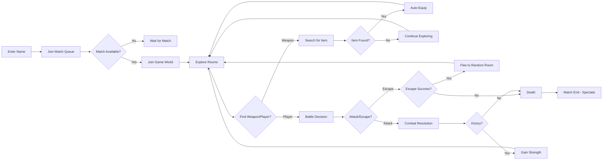
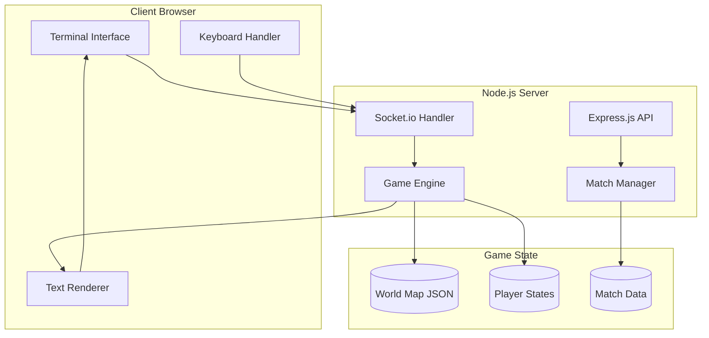
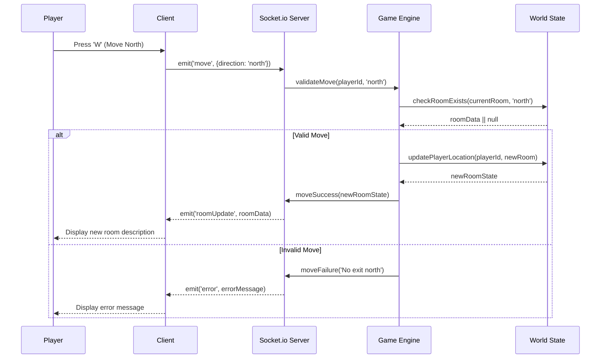
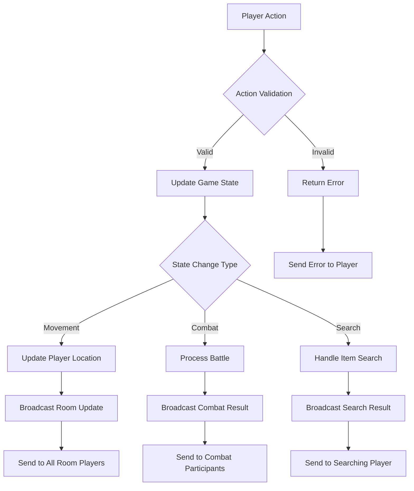
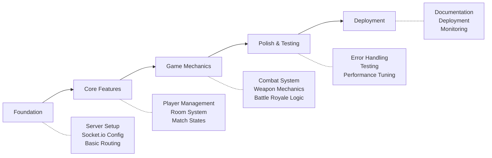

# JogoTesto - Text-Based Multiplayer Battle Royale RPG
## Product Requirements Document (PRD)

---

## 1. Executive Summary

### Problem Statement
Friends and family need a simple, accessible multiplayer gaming experience that doesn't require high-end hardware or complex interfaces. Traditional battle royale games are resource-intensive and often too complex for casual family gaming sessions.

### Solution Overview
JogoTesto is a text-based multiplayer RPG battle royale game built with Node.js, Socket.io, and Express.js. It combines the excitement of battle royale mechanics with the accessibility of text-based gameplay, allowing up to 20 players to compete in a shared world using simple keyboard commands.

### Success Metrics
- **Player Engagement**: Average match completion rate > 80%
- **Accessibility**: Game playable on any device with basic browser
- **Performance**: Sub-100ms response time for player actions
- **Stability**: Zero crashes during matches
- **User Experience**: Players can learn controls within first 2 minutes

---

## 2. User Stories & Scenarios

### Primary User Flow


### Core User Stories

#### Story 1: Match Joining
**As a** player  
**I want** to join a battle royale match with friends  
**So that** we can have fun competing against each other

**Acceptance Criteria:**
- [ ] Player enters unique username to join
- [ ] System validates username uniqueness within match
- [ ] Player sees "waiting for match" if no active game
- [ ] Player sees "match in progress" if trying to join active match
- [ ] Match starts automatically when minimum players join

**Technical Notes:**
- Username validation and storage
- Match state management
- Socket room management for player grouping

#### Story 2: World Exploration
**As a** player  
**I want** to move through interconnected rooms  
**So that** I can explore the game world and find resources

**Acceptance Criteria:**
- [ ] WASD keys control movement (W=North, A=West, S=South, D=East)
- [ ] Room descriptions display when entering new area
- [ ] Available exits clearly indicated
- [ ] Invalid movement attempts show helpful error message
- [ ] Room state persists for all players

**Edge Cases:**
- Attempting to move through non-existent exits
- Multiple players entering same room simultaneously
- Room state consistency across network interruptions

#### Story 3: Combat System
**As a** player  
**I want** to engage in strategic combat with other players  
**So that** I can eliminate opponents and win the match

**Acceptance Criteria:**
- [ ] Combat prompt appears when encountering another player
- [ ] Attack/Escape decision menu with clear controls
- [ ] Damage calculation includes player strength + weapon damage
- [ ] Battle winner determined by total damage comparison
- [ ] Escape success/failure has defined probability
- [ ] Victory increases player strength permanently

**Edge Cases:**
- Player disconnection during combat
- Multiple players attacking same target
- Combat resolution during network lag

#### Story 4: Weapon Collection
**As a** player  
**I want** to find and collect weapons  
**So that** I can increase my combat effectiveness

**Acceptance Criteria:**
- [ ] Weapon presence indicated in room descriptions
- [ ] 2-second search duration with vulnerability window
- [ ] Automatic weapon equipping upon discovery
- [ ] Stronger weapons are rarer than weaker ones
- [ ] Weapon stats clearly displayed to player

**Edge Cases:**
- Interruption during weapon search
- Multiple players searching same room
- Weapon spawn rate balancing

---

## 3. System Architecture

### High-Level Architecture


### Component Breakdown

#### Frontend Components
- **Terminal Interface**: Text-based console display showing game state
- **Keyboard Handler**: Captures and processes player input (WASD, menu selections)
- **Text Renderer**: Formats and displays room descriptions, combat results, notifications

#### Backend Services
- **Express.js API**: Handles HTTP endpoints for match status, health checks
- **Socket.io Handler**: Manages real-time bidirectional communication
- **Game Engine**: Core game logic, combat resolution, movement validation
- **Match Manager**: Match creation, player queuing, match state transitions

#### Data Models
- **Player**: `{id, name, room, strength, weapon, status, socketId}`
- **Room**: `{id, description, exits[], hasWeapon, weaponStats}`
- **Match**: `{id, players[], status, startTime, worldState}`
- **Weapon**: `{id, name, damage, rarity}`

---

## 4. Technical Specifications

### Real-Time Communication Flow


### API Endpoints

#### WebSocket Events (Socket.io)
- **Client → Server Events:**
  - `joinMatch`: `{playerName: string}` → Join match queue
  - `move`: `{direction: 'north'|'south'|'east'|'west'}` → Move between rooms
  - `search`: `{}` → Search current room for weapons
  - `combat`: `{action: 'attack'|'escape'}` → Combat decision
  - `disconnect`: `{}` → Handle player disconnection

- **Server → Client Events:**
  - `matchJoined`: `{playerId, matchId, status}` → Confirm match join
  - `matchStarted`: `{worldState, playerData}` → Match begins
  - `roomUpdate`: `{description, exits, hasWeapon, players}` → Room state
  - `combatPrompt`: `{opponent, options}` → Combat decision needed
  - `combatResult`: `{winner, loser, newStats}` → Battle outcome
  - `searchResult`: `{found, weapon}` → Weapon search outcome
  - `playerDeath`: `{killedBy, finalStats}` → Player elimination
  - `matchEnd`: `{winner, finalRankings}` → Match conclusion
  - `error`: `{message}` → Error notifications

#### HTTP REST Endpoints
- **GET /api/status** → Server health check
- **GET /api/matches** → Current match information
- **POST /api/debug/reset** → Reset server state (development only)

### Game State Management


---

## 5. Implementation Strategy

### Development Phases


### Implementation Priority

#### Phase 1: Foundation (Week 1)
- **Server Infrastructure**: Express.js server with Socket.io integration
- **Basic Client**: Simple HTML interface with terminal emulation
- **Connection Management**: Player connect/disconnect handling
- **World Loading**: JSON-based room system with basic navigation

#### Phase 2: Core Features (Week 2)
- **Player Management**: Username validation, player state tracking
- **Match System**: Single match handling, player queuing
- **Room Navigation**: WASD movement with validation
- **Basic UI**: Terminal interface with command input

#### Phase 3: Game Mechanics (Week 3)
- **Combat System**: Player vs player battles with damage calculation
- **Weapon System**: Item searching, automatic equipping, damage bonuses
- **Battle Royale Logic**: Player elimination, match win conditions
- **Strength Progression**: Victory-based character improvement

#### Phase 4: Polish & Testing (Week 4)
- **Error Handling**: Graceful failure management, reconnection logic
- **Testing Suite**: Unit tests for core game mechanics
- **Performance Optimization**: State management improvements
- **User Experience**: Better messaging, clearer instructions

#### Phase 5: Deployment (Week 5)
- **Production Setup**: Server deployment configuration
- **Documentation**: Setup and gameplay instructions
- **Monitoring**: Basic logging and error tracking
- **Launch**: Family and friends testing session

---

## 6. Technical Challenges & Mitigations

### Challenge Analysis
```yaml
challenges:
  technical_risks:
    - risk: "Race conditions in combat resolution"
      impact: "High - could lead to unfair outcomes"
      mitigation: "Implement action queuing and atomic state updates"
    
    - risk: "Socket connection instability"
      impact: "Medium - players could lose progress"
      mitigation: "Add reconnection logic with state recovery"
    
    - risk: "Memory leaks from incomplete matches"
      impact: "Medium - server performance degradation"
      mitigation: "Implement automatic cleanup and garbage collection"
  
  game_design_risks:
    - risk: "Weapon balance issues"
      impact: "Low - affects gameplay enjoyment"
      mitigation: "Configurable weapon stats with easy adjustment"
    
    - risk: "Match duration too long/short"
      impact: "Medium - player engagement"
      mitigation: "Adjustable world size and weapon spawn rates"
  
  edge_cases:
    - scenario: "Player disconnects during combat"
      handling: "Auto-resolve combat in favor of connected player"
    
    - scenario: "Multiple players search same room simultaneously"
      handling: "First searcher gets priority, others receive 'already searched' message"
    
    - scenario: "Match ends with network partition"
      handling: "Server-side timeout declares winner based on remaining players"
```

### Success Validation Criteria

#### Definition of Done
- [ ] 20 players can join and complete a match without crashes
- [ ] All movement commands respond within 100ms
- [ ] Combat system produces consistent, predictable results
- [ ] Weapon spawn rates create balanced gameplay
- [ ] Player disconnection/reconnection works gracefully
- [ ] Match completion rate exceeds 80% in testing

#### Measurable Outcomes
- **Response Time**: < 100ms for all player actions
- **Match Completion**: > 80% of started matches finish successfully
- **Player Learning**: New players understand controls within 2 minutes
- **System Stability**: Zero server crashes during 10 consecutive matches

---

## 7. World Design Specification

### World Map Structure
```json
{
  "rooms": {
    "spawn": {
      "id": "spawn",
      "description": "A barren starting ground. Multiple paths lead to different areas.",
      "exits": {
        "north": "forest_entrance",
        "east": "river_crossing",
        "south": "desert_edge",
        "west": "mountain_base"
      },
      "weaponSpawnChance": 0.1
    },
    "forest_entrance": {
      "id": "forest_entrance", 
      "description": "Dense trees block most of the sunlight. A thick forest lies to the north, while the starting ground is visible to the south.",
      "exits": {
        "north": "deep_forest",
        "south": "spawn",
        "east": "forest_clearing"
      },
      "weaponSpawnChance": 0.3
    }
  },
  "weapons": {
    "stick": {"damage": 1, "rarity": 0.6},
    "knife": {"damage": 3, "rarity": 0.3},
    "sword": {"damage": 5, "rarity": 0.1}
  }
}
```

### Room Generation Rules
- **Minimum 12 rooms** for balanced 20-player matches
- **Multiple paths** between areas to prevent bottlenecks
- **Strategic weapon placement** in harder-to-reach locations
- **Descriptive text** that hints at available exits and items

---

## 8. Testing Strategy

### Test Coverage Requirements
- **Unit Tests**: Core game logic (movement, combat, weapon systems)
- **Integration Tests**: Socket.io event handling and state synchronization
- **Load Tests**: 20 concurrent players performing actions
- **Edge Case Tests**: Network interruption, invalid input handling

### Testing Scenarios
1. **Happy Path**: Complete match from start to finish
2. **Combat Edge Cases**: Simultaneous attacks, escape failures
3. **Network Issues**: Disconnection during critical actions
4. **Input Validation**: Invalid commands, malformed data
5. **Race Conditions**: Multiple players performing simultaneous actions

---

## 9. Deployment & Monitoring

### Deployment Configuration
- **Environment**: Node.js 18+ with PM2 process management
- **Dependencies**: Express.js, Socket.io, minimal additional packages
- **Configuration**: Environment-based settings for different deployment stages
- **Security**: Input validation, rate limiting, basic DoS protection

### Monitoring Requirements
- **Performance Metrics**: Response times, memory usage, active connections
- **Game Metrics**: Match completion rates, average match duration
- **Error Tracking**: Unhandled exceptions, socket connection failures
- **Usage Analytics**: Player actions, popular strategies, balance issues

---

## 10. Appendices

### Research Summary
Based on market research, text-based battle royale games are rare, with "Text Royale" being the closest comparable project. Most multiplayer text-based games are persistent RPGs (MUDs) rather than match-based battle royales, making JogoTesto a unique entry in this space.

### Alternative Approaches Considered
1. **Turn-based combat**: Rejected for simplicity - real-time is more engaging
2. **Persistent world**: Rejected for complexity - matches provide clear sessions
3. **More complex statistics**: Rejected for YAGNI - single strength stat is sufficient
4. **Graphic interface**: Rejected for accessibility - text works on any device

### Success Metrics Details
- **Engagement**: Measured by match completion rates and replay frequency
- **Accessibility**: Tested across different devices and browsers
- **Performance**: Automated monitoring of response times and resource usage
- **Family-Friendly**: Feedback collection from target user group

---

*This PRD serves as the comprehensive specification for implementing JogoTesto. All implementation PRPs should reference this document for requirements validation and architectural guidance.*