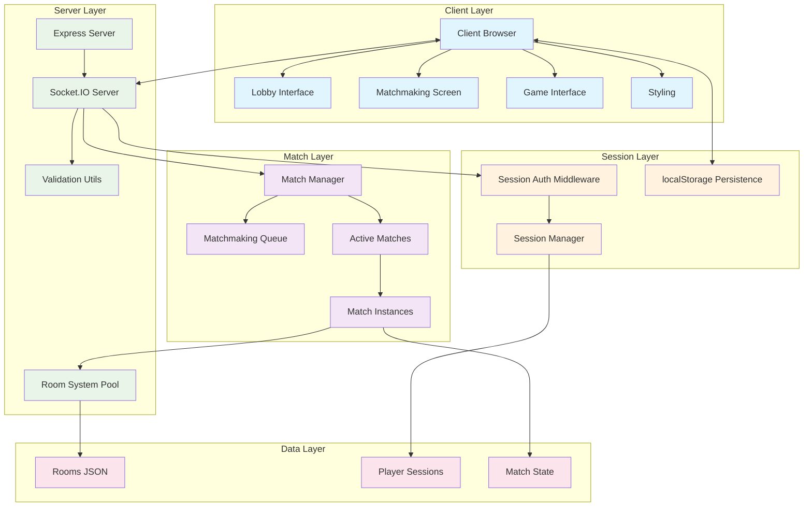
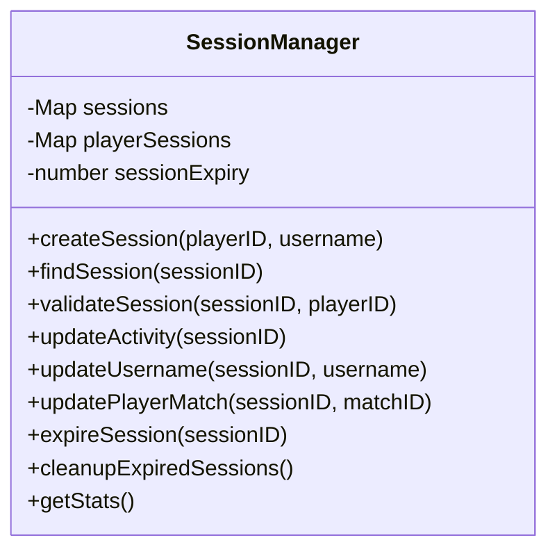
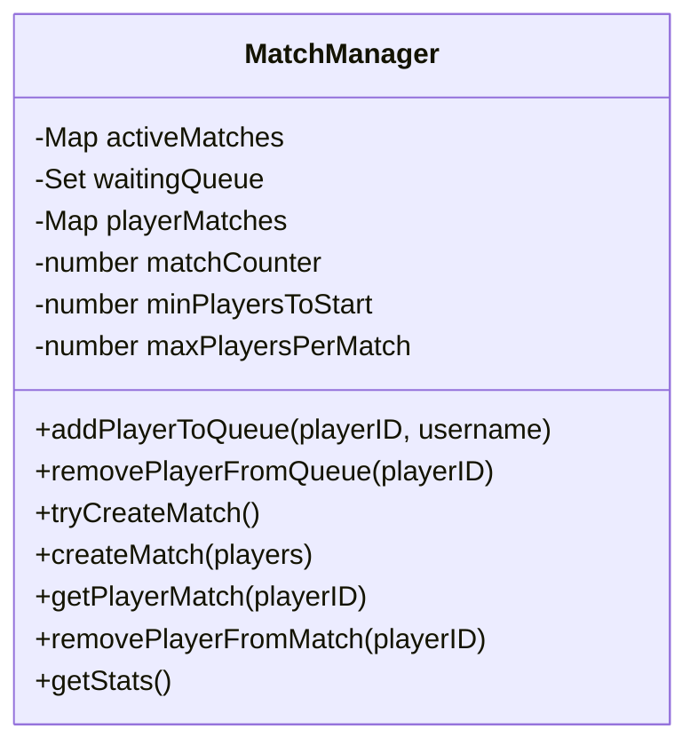
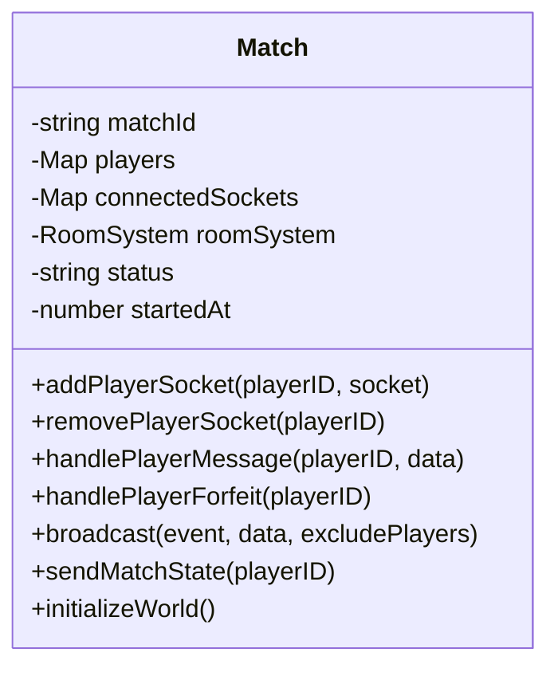
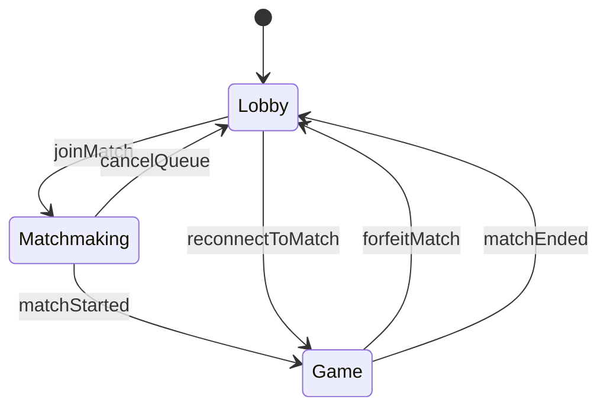
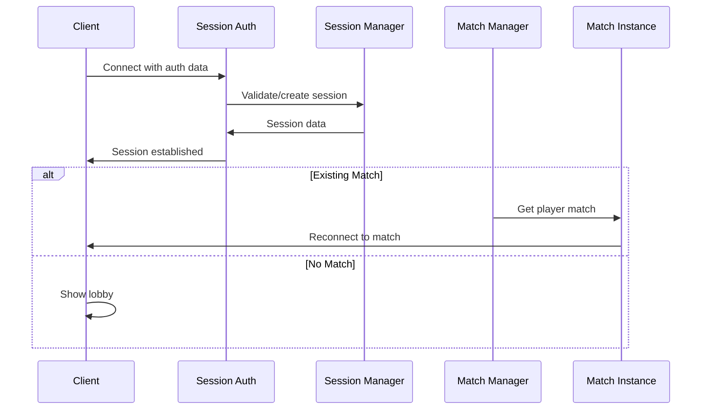
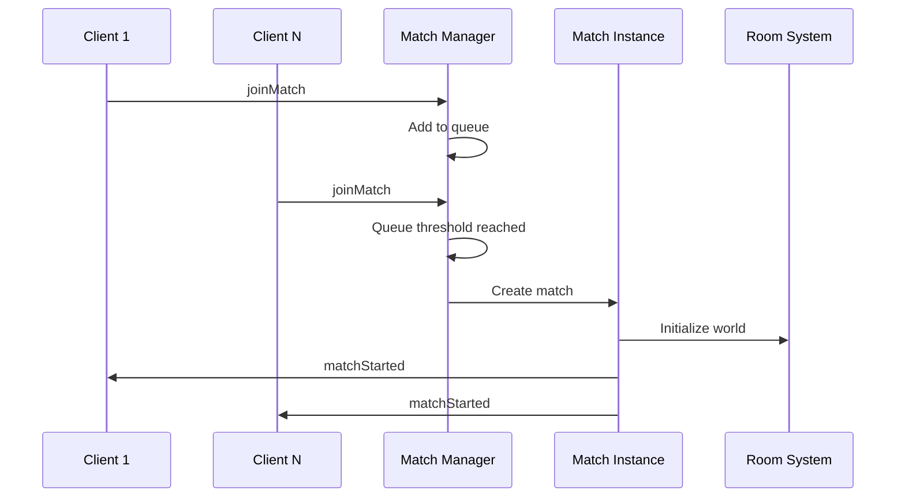
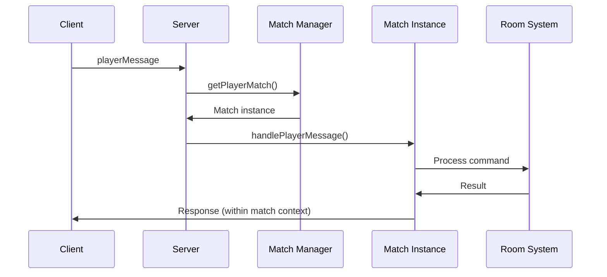

# JogoTesto - Architecture Documentation

## Overview

JogoTesto is a multiplayer Battle Royale text-based RPG that leverages AI-driven development through Product Requirement Prompts (PRPs). The application provides real-time multiplayer functionality with a sophisticated match system supporting up to 50 players per match, built using Node.js, Express, and Socket.IO with persistent session management.

## System Architecture



## Core Components

### 1. Session Management System

#### Session Manager (`src/systems/sessionManager.js`)
Manages persistent player identity across reconnections using a two-ID system.



**Key Features:**
- Two-ID authentication (sessionID + playerID)
- 24-hour session expiry with automatic cleanup
- Persistent username and match association
- Reconnection state recovery

#### Session Authentication (`src/middleware/sessionAuth.js`)
Socket.IO middleware that handles session restoration and new session creation.

```javascript
// Authentication flow
socket.on('connect') -> sessionAuth -> 
  existing session ? restore : create new ->
  attach session data to socket
```

### 2. Match Management System

#### Match Manager (`src/systems/matchManager.js`)
Orchestrates matchmaking queue and match lifecycle management.



**Features:**
- Queue-based matchmaking (10-50 players)
- Automatic match creation when minimum threshold reached
- Player-to-match relationship tracking
- Match statistics and monitoring

#### Match Instance (`src/systems/match.js`)
Individual match with isolated RoomSystem and player management.



**Key Features:**
- Isolated RoomSystem instance per match
- Independent game world with full room navigation
- Match-specific player communication
- Forfeit handling and match cleanup

### 3. Enhanced Server Layer (`src/server.js`)

**New Responsibilities:**
- Session-aware connection management
- Match-based message routing
- Reconnection handling with match state recovery
- Matchmaking event coordination

**Key Event Handlers:**
- `joinMatch` - Add player to matchmaking queue
- `cancelQueue` - Remove player from queue
- `forfeitMatch` - Handle match forfeit
- `playerMessage` - Route messages to match context

### 4. Client Interface Evolution

#### Multi-Screen Architecture
- **Lobby Screen**: Username entry and match joining
- **Matchmaking Screen**: Queue status and waiting interface  
- **Game Screen**: Full match interface with forfeit option

#### Enhanced Client (`public/client.js`)


**New Functions:**
- `joinMatchQueue()` - Handle match joining with validation
- `handleMatchStart()` - Transition to game screen
- `handleReconnection()` - Process reconnection scenarios
- `forfeitMatch()` - Handle match forfeit
- `showScreen()` - Manage screen transitions

## Data Flow Architecture

### Session-Aware Connection Flow


### Matchmaking Flow


### Match Message Flow


## Enhanced Security & Validation

### Match Validation (`src/utils/matchValidation.js`)
- Player eligibility validation
- Match state consistency checks
- Movement validation within match context
- Chat message filtering for match isolation

### ID Generation (`src/utils/idGenerator.js`)
- Cryptographically secure ID generation
- Format validation for all ID types
- Collision-resistant match IDs

## Session Persistence

### Client-Side Storage
```javascript
// Session data persisted in localStorage
{
  sessionID: "session_abc123...",
  playerID: "player_def456...", 
  username: "PlayerName"
}
```

### Server-Side Session State
```javascript
// Session object structure
{
  sessionID: string,
  playerID: string,
  username: string,
  createdAt: timestamp,
  lastActivity: timestamp,
  matchID: string|null,
  isActive: boolean
}
```

## Match System Design

### Match Lifecycle
1. **Queue Phase**: Players join matchmaking queue
2. **Creation Phase**: Match created when 10+ players available
3. **Active Phase**: Match running with isolated world
4. **Completion Phase**: Match ends, players return to lobby

### Isolation Architecture
- Each match has its own RoomSystem instance
- Independent room navigation per match
- Isolated player communication
- Separate match timers and state

## Testing Architecture

### Enhanced Test Suite
- **Unit Tests**: Session management, match management, ID generation
- **Integration Tests**: Multi-match scenarios, reconnection flows
- **76/77 tests passing** with comprehensive coverage

### Test Categories
- Session persistence and validation
- Match creation and lifecycle
- Reconnection scenarios
- Error handling and edge cases

## Performance & Scalability

### Memory Management
- Session cleanup with 24-hour expiry
- Match instance garbage collection
- Efficient Map-based data structures
- Per-match RoomSystem isolation

### Scalability Features
- Support for multiple concurrent matches
- Session-based reconnection (not socket-dependent)
- Stateless authentication middleware
- Event-driven match coordination

## Development Commands

```bash
npm start      # Start the Battle Royale server
npm test       # Run comprehensive test suite
npm run lint   # Code quality validation
```

## Technology Stack

- **Backend**: Node.js, Express.js, Socket.IO v4.8.1
- **Session Management**: In-memory with localStorage persistence
- **Frontend**: Vanilla JavaScript with multi-screen SPA
- **Testing**: Node.js built-in test runner (76/77 tests)
- **Code Quality**: ESLint with comprehensive rules
- **Architecture**: Event-driven with isolated match instances

## Current Battle Royale Features

### Implemented
- ✅ **Multi-Match Support**: Up to 50 players per match
- ✅ **Persistent Sessions**: Reconnection to active matches
- ✅ **Queue System**: Automatic matchmaking (10-50 players)
- ✅ **Match Isolation**: Independent worlds per match
- ✅ **Forfeit System**: Leave match and return to lobby
- ✅ **Full UI**: Lobby → Matchmaking → Game screens
- ✅ **Error Handling**: Comprehensive validation and recovery

### Ready for Enhancement
- Database integration for persistent statistics
- Match history and player rankings
- Advanced matchmaking with skill-based matching
- Spectator mode for completed matches
- Tournament bracket system

## Future Architecture Considerations

### Immediate Enhancements
- Comprehensive test suite for new components
- Match statistics and analytics
- Advanced reconnection scenarios
- Performance monitoring and metrics

### Long-term Scaling
- Redis-based session persistence
- Microservices for match management
- Database integration for match history
- Advanced matchmaking algorithms
- Real-time match spectating

---

*This documentation reflects JogoTesto's evolution from a single-world text RPG to a sophisticated Battle Royale system supporting multiple concurrent matches with persistent session management.*